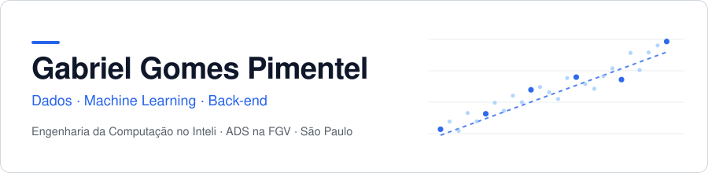
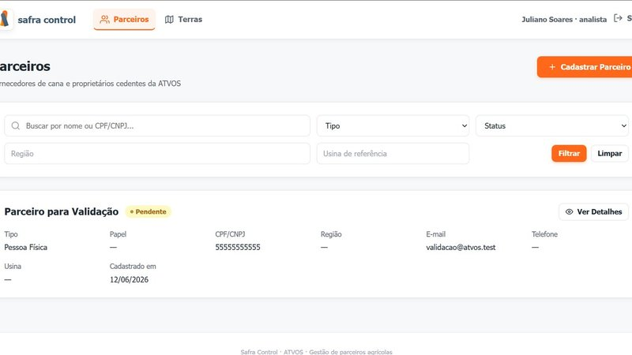
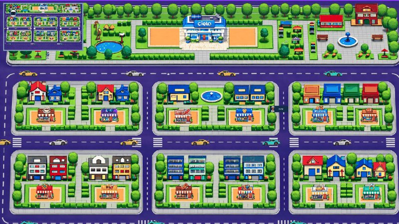
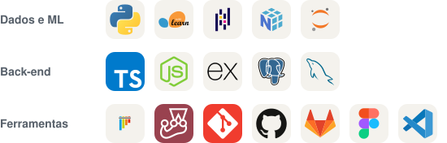
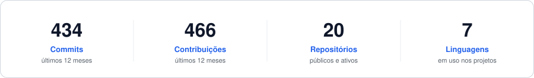

<picture>
  <source media="(prefers-color-scheme: dark)" srcset="assets/header-dark.svg" />
  
</picture>

  &nbsp;
  
   
  <a href="https://gabriel-gomes-pimentel.github.io/portifolio-desenvolvedor/"><b>Portfólio</b></a> ·
  <a href="https://gabriel-gomes-pimentel.github.io/portifolio-desenvolvedor/assets/Curriculo_Gabriel_Gomes_Pimentel.pdf"><b>Currículo</b></a> ·
  Aberto a estágio em dados, ML ou back-end

Desenvolvo modelos de machine learning e sistemas back-end para empresas reais. No Inteli, cada módulo é um projeto entregue a um parceiro, e já foram três: **Azul**, **ATVOS** e **Cielo**.

## Projetos

<table>
<tr>
<td width="40%"></td>
<td>

**[Safira](https://github.com/Gabriel-Gomes-Pimentel/safira-azul-nps)** · Azul Linhas Aéreas 
Prevê quais Clientes vão detratar no NPS antes da resposta à pesquisa.

**51 de cada 100** contatos chegam a um Detrator, contra 20 ao acaso.

`Python` `scikit-learn` `pandas`

</td>
</tr>
<tr>
<td width="40%"></td>
<td>

**[Safra Control](https://github.com/Gabriel-Gomes-Pimentel/safra-control)** · ATVOS 
CRM que substituiu as planilhas de parceiros de terra e fornecedores de cana.

**Aprovado e em produção** na ATVOS.

`TypeScript` `Node.js` `PostgreSQL`

</td>
</tr>
<tr>
<td width="40%"></td>
<td>

**[As Aventuras de Marcielo](https://github.com/Gabriel-Gomes-Pimentel/projeto-cielo)** · Cielo 
Serious game que simula a rotina do Gerente de Negócios.

**Aprovado para os treinamentos** da Cielo.

`JavaScript` `Phaser 3`

</td>
</tr>
</table>

## Stack

<picture>
  <source media="(prefers-color-scheme: dark)" srcset="assets/stack-dark.svg" />
  
</picture>

## Formação

**Inteli** · Engenharia da Computação&emsp;|&emsp;**FGV** · Análise e Desenvolvimento de Sistemas

 

<picture>
  <source media="(prefers-color-scheme: dark)" srcset="assets/stats-dark.svg" />
  
</picture>

<picture>
  <source media="(prefers-color-scheme: dark)" srcset="https://raw.githubusercontent.com/Gabriel-Gomes-Pimentel/Gabriel-Gomes-Pimentel/output/snake-dark.svg" />
  
</picture>
